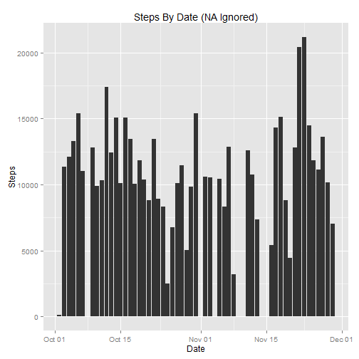
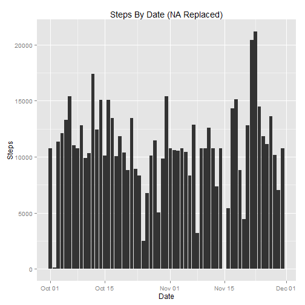

## Loading and preprocessing the data

```r
library(lattice)
ds <- read.csv("activity.csv", header=TRUE)
ds$date <- as.Date(ds$date, format="%Y-%m-%d")
dsc <- na.omit(ds)
```
  
## What is mean total number of steps taken per day?

```r
sds <- aggregate(steps ~ date, data = dsc, FUN = sum) 
meanStepsPerDay = mean(sds$steps)
medianStepsPerDay = median(sds$steps)
meanStepsPerDayStr = sprintf("%.2f", meanStepsPerDay)
medianStepsPerDayStr = sprintf("%.2f", medianStepsPerDay)

plot(sds$date, sds$steps, type="h", main="Steps By Date (NA Ignored)", xlab="Date",ylab="Steps")
```

 

*Mean number of steps taken per day : __10766.19__*  
*Median number of steps taken per day : __10765.00__*  

  
## What is the average daily activity pattern?

```r
dap <- aggregate(steps ~ interval, data = dsc, FUN = mean) 
mpos <- which.max(dap$steps)
maxInterval <- dap$interval[mpos]
plot(dap$interval, dap$steps, type="h", main="Mean Number Of Steps By Interval", xlab="Interval",ylab="Steps (Mean)")
abline(v=maxInterval, col="red")
```

 

*Maximum average number of steps was taken during interval : __835__ (red vertical line in graph above)*  


## Imputing missing values

```r
missingDataRows <- nrow(ds) - nrow(dsc)
```

*Rows missing data : __2304__*  


Strategy : Replace missing step values (NA) with the mean number of steps associated with the interval of the missing record. The mean associated with the interval was calculated in the previous exercise.  


```r
#backfill na values withe interval average
dsf <- ds
n <- nrow(dsf)
for( v in 1:n)  {
  if (is.na(dsf$steps[v])) {
    intervalVal <- as.numeric(dsf$interval[v])
    intervalAve <- as.numeric(subset(dap, interval == intervalVal, select = steps))
    dsf$steps[v] <- intervalAve
    #print(intervalVal)
    #print(intervalAve)
  }
}
fdsds <- aggregate(steps ~ date, data = dsf, FUN = sum) 
fdmeanStepsPerDay = mean(fdsds$steps)
fdmedianStepsPerDay = median(fdsds$steps)
fdmeanStepsPerDayStr = sprintf("%.2f", fdmeanStepsPerDay)
fdmedianStepsPerDayStr = sprintf("%.2f", fdmedianStepsPerDay)

plot(fdsds$date, fdsds$steps, type="h", main="Steps By Date (NA Replaced)", xlab="Date",ylab="Steps")
```

 

*Filled Data: Mean number of steps taken per day : __10766.19__*  
*Filled Data: Median number of steps taken per day : __10766.19__*  

Compare 'NA Ignored' in data source vs. 'NA Replaced' in data source  

Data Source | Mean | Median
----------- | ---- | ------
NA Ignored  | 10766.19 | 10765.00
NA Replaced | 10766.19 | 10766.19


Observation: With our chosen replacement strategy there is very little difference between the calculated means and medians. It really all depends on the replacement strategy. If we had replaced all NA's with 0, we would have got different results.


## Are there differences in activity patterns between weekdays and weekends?
Differences in the weekend and weekday activity patterns are show in the graph below (after code)  


```r
# new factor variable is dtype
dtype <- character(n)
lastday <- as.Date('1900-01-01',format="%Y-%m-%d")
lastwd <- ''
for( v in 1:n)  {
  cd <- dsf$date[v]
  if (lastday != cd) {
    lastday <- cd
    lastwd <- weekdays(cd)
  }
  wd <- lastwd
  dtype[v]='weekday'
  if (wd == "Sunday" || wd == "Saturday") {
    dtype[v]='weekend'
  }
}

dsf$dayType <- factor(dtype)

dap2 <- aggregate(steps ~ interval*dayType, data = dsf, FUN = mean) 
mpos2 <- which.max(dap2$steps)
maxSteps2 <- dap2$steps[mpos]

xyplot( steps ~ interval | dayType, type="l", main="Weekday and Weekend Activity Patterns", data = dap2, layout=c(1,2))
```

 

